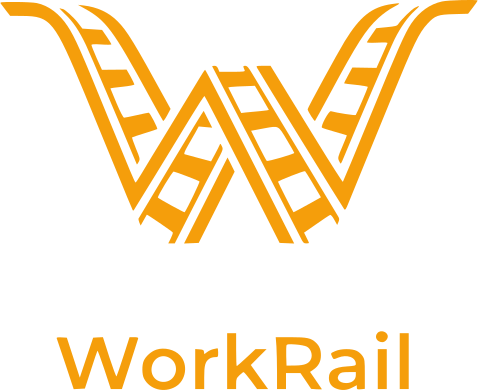

<div align="center">
  
  <h1>WorkRail</h1>
  <p>Step-by-step workflow enforcement for AI agents</p>

[](https://www.npmjs.com/package/@exaudeus/workrail)
[](https://modelcontextprotocol.org)
[](LICENSE)
</div>

---

## The Problem

AI agents are eager to help. Too eager.

Ask one to fix a bug and it starts editing code immediately - before understanding the system, before
considering alternatives, before verifying assumptions. It's not stupid; it's a predictive model
doing what predictive models do: fill in gaps and race to an answer.

You can add system prompts or skills: "plan before coding," "gather context first," "follow our
architecture guidelines." But system prompts fade as conversations grow. Skills front-load all
guidance at once - which works for simple tasks but breaks down when the task is long and the
guidance is complex. The agent reverts to its default: assume, predict, jump to conclusions.

The deeper problems compound from there:

- **Tasks left incomplete** - the agent ships something that looks done but skips the hard parts
- **Guidelines ignored** - your architecture rules, best practices, and team conventions aren't enforced; the agent knows them but doesn't apply them
- **No audit trail** - when AI work goes wrong, there's no record of what decisions were made or why
- **Context lost between sessions** - every new conversation starts from zero; prior work, decisions, and context vanish
- **Parallelism is chaos** - running multiple AI tasks simultaneously means constant context-switching and re-explaining; there's no shared structure

**The result: inconsistent quality that depends on how much you babysit the agent.**

---

## How WorkRail Works

WorkRail replaces the human effort of guiding an agent step-by-step.

Instead of one system prompt that fades over time, WorkRail drip-feeds instructions through
the [Model Context Protocol](https://modelcontextprotocol.org). The agent calls `start_workflow`,
gets the first step, completes it, calls `continue_workflow`. Future steps stay hidden until previous ones are done.

**The agent can't skip to implementation because it doesn't know those steps exist yet.**

Sessions are durable. Work is saved to disk at every step and can be resumed across conversations
with `resume_session` — pick up exactly where you left off, even days later or in a fresh chat.

### The Mechanism

```
You                      Agent                     WorkRail
 │                         │                          │
 │  "Fix the auth bug"     │                          │
 │────────────────────────>│                          │
 │                         │                          │
 │                         │  start_workflow()        │
 │                         │─────────────────────────>│
 │                         │                          │
 │                         │   Step 1: Understand     │
 │                         │      the problem         │
 │                         │<─────────────────────────│
 │                         │                          │
 │   "What error do you    │                          │
 │    see exactly?"        │                          │
 │<────────────────────────│                          │
 │                         │                          │
 │         ...             │  continue_workflow()     │
 │                         │─────────────────────────>│
 │                         │                          │
 │                         │   Step 2: Plan your      │
 │                         │      investigation       │
 │                         │<─────────────────────────│
```

### Without WorkRail

```
You:   "There's a bug in the auth flow"

Agent: "I see the issue! In auth.js line 42, there's a null check that 
        should handle this. Let me fix it..."
        
        *edits code based on a 30-second skim*
        *breaks something else*
```

### With WorkRail

```
You:   "There's a bug in the auth flow"

Agent: "I'll use the bug-investigation workflow."
        → start_workflow()
       
       Step 1: Investigation Setup
       "Before I investigate, I need to understand the problem.
        What exactly happens when it fails? Can you share the error?"
       
       [Documents bug, reproduction steps, environment]
        → continue_workflow()
       
       Step 2: Plan Investigation
       "I'll trace execution from login through the auth middleware.
        Key areas: token validation, session lookup, error handling."
       
       [Creates investigation plan before touching code]
        → continue_workflow()
       
       Step 3: Form Hypotheses
       "Based on my analysis, three possible causes:
        H1: Clock skew in token validation (7/10)
        H2: Race condition in session lookup (6/10)
        H3: Null check masking the real error (4/10)"
       
       [Tests hypotheses systematically, gathers evidence, proves root cause]
```

Same agent. Same model. But it prepared properly because it had no choice.

### Why Steps Are Structured This Way

Each step follows a pattern that prevents common AI failure modes:

- **Prep**: Understand before acting - read the code, clarify requirements, confirm approach
- **Implement**: One focused change - not five things at once
- **Verify**: Validate before continuing - catch errors before they compound

This isn't arbitrary structure. It's how experienced developers actually work.

### Durable Sessions

Sessions persist to disk at every step. Close the chat, come back tomorrow, pick up exactly where
you left off:

```
# New conversation, days later
> "Resume the auth refactor I was working on"

Agent: → resume_session()

WorkRail: Found your session from 3 days ago.
          You were on Step 4: Implement token rotation.
          Here's what you had documented so far...
```

Each step's output — notes, decisions, artifacts — is saved and concatenated automatically. No
context re-setup. No re-explaining what was already done.

### Visibility and Audit Trail

The WorkRail Console is a browser dashboard that shows every active and completed session. It
auto-boots when you use WorkRail and gives you a live view of what the agent is doing, what it has
done, and what decisions it made at each step.

Open it anytime with `worktrain console`.

### Running Tasks in Parallel

Because sessions are independent and durable, you can run multiple AI tasks simultaneously without
babysitting any of them. Start five workflows, let each agent work through its steps, check in when
they checkpoint. No context-switching overhead — each session has its own complete state.

### Why This Beats System Prompts

| System Prompt / Skill | WorkRail |
|-----------------------|----------|
| "Plan first" fades as context grows | Each step is fresh and immediate |
| Agent decides what to follow | Agent can't skip - next step is hidden |
| Skills front-load all guidance at once | Guidance is delivered one step at a time, in context |
| One-size-fits-all instructions | Workflows encode your team's rules and best practices |
| Inconsistent results | Repeatable, consistent quality |
| Stateless — context lost when chat ends | Durable sessions — resume exactly where you left off |
| One task at a time or constant context-switching | Independent sessions run in parallel without babysitting |

---

## Quick Start

Add to your MCP client config (Claude Code, Cursor, Firebender, Antigravity, etc.):

```json
{
  "mcpServers": {
    "workrail": {
      "command": "npx",
      "args": ["-y", "@exaudeus/workrail"]
    }
  }
}
```

Then prompt your agent:

> "Use the bug-investigation workflow to debug this auth issue"

The agent will find the workflow, start at step 1, and proceed systematically.

### Troubleshooting: "Permission denied" on startup

Versions before 3.19.0 were published without the execute bit set on the binary.
If you see `Permission denied` when WorkRail starts, reinstall or fix it in place:

```sh
# Option A: reinstall (recommended)
npm install -g @exaudeus/workrail

# Option B: fix in place without reinstalling
chmod +x $(npm root -g)/@exaudeus/workrail/dist/mcp-server.js
```

---

## Reporting and Metrics

WorkRail captures rich session metrics automatically -- every workflow run records token usage,
git diffs, step counts, language breakdowns, code churn, and agent-reported outcomes. The
`workrail report` command surfaces all of this as structured data.

```bash
workrail report --days 30               # NDJSON to stdout (default, streamable)
workrail report --days 30 --format html --out report.html  # open in browser
workrail report --days 30 --format csv  # spreadsheet-ready
workrail report --days 30 --format summary  # aggregates only
workrail report --days 30 | jq '.summary'   # pipe to jq
```

**Available formats:** `ndjson` (default), `json`, `summary`, `csv`, `html`

**What is captured per session:**
- Token delta (input, output, cache) via Claude Code JSONL scanning
- Git diff: lines added/removed, files changed, language breakdown, commit SHAs, PR refs
- Code churn: files re-modified within 7 days of session end
- Agent-reported outcome (success/partial/abandoned/error)
- Step count and retry count from the DAG
- Duration, workflow ID, goal, project

The full schema is documented in
[`docs/reference/session-metrics-reference.md`](docs/reference/session-metrics-reference.md).

**Automatic generation:**

```bash
workrail report --schedule daily    # macOS: installs launchd plist
workrail report --schedule weekly   # Linux: adds crontab entry
```

This writes `~/.workrail/data/reports/latest.json` nightly, which tools like
[common-ground](https://github.com/EtienneBBeaulac/workrail) can read for team-level reporting.

---

## CI & Releases

- **Lockfile is enforced**: `package-lock.json` is canonical and CI will fail if `npm ci` would modify it. Commit lockfile changes intentionally.
- **Release authority**: releases are produced by **semantic-release** in GitHub Actions (don’t bump versions/tags locally).
- **Major releases are approval-gated**: breaking changes become **minor by default** and only become **major** when `WORKRAIL_ALLOW_MAJOR_RELEASE=true`.
- **Release type comes from the commit on `main`**: for squash merges, the PR title / squash commit title controls whether the release is patch, minor, major, or untagged. See `docs/reference/releases.md`.
- **Preview a release (dry-run)**:
  - **Locally**: `npx semantic-release --dry-run --no-ci`
  - **Locally (major allowed)**: `WORKRAIL_ALLOW_MAJOR_RELEASE=true npx semantic-release --dry-run --no-ci`
- **In Actions**: run the **Release (dry-run)** workflow (`.github/workflows/release-dry-run.yml`).
- **Full release policy**: see [`docs/reference/releases.md`](docs/reference/releases.md)

---

## Included Workflows

30+ workflows included for development, debugging, review, documentation, and more:

| Workflow | When to Use |
|----------|-------------|
| `coding-task-workflow-agentic` | Feature development with notes-first durability and audit loops |
| `bug-investigation.agentic.v2` | Systematic debugging with evidence-based analysis |
| `mr-review-workflow.agentic.v2` | Code review with parallel reviewer families |
| `wr.discovery` | Upstream exploration, framing, and design synthesis |
| `wr.shaping` | Shape a fuzzy problem into an implementation-ready pitch |
| `document-creation-workflow` | Technical documentation with structure |
| `architecture-scalability-audit` | Audit a service for production readiness and scalability |

Workflows adapt to complexity - simple tasks get fast-tracked, complex tasks get full rigor.

[See all workflows →](docs/workflows.md)

---

## The Philosophy

### Guardrails Enable Excellence

WorkRail doesn't lobotomize your AI. The agent still reasons, explores, and creates - but within a
structure that ensures it actually prepares, plans, and verifies. Guardrails prevent shortcuts, not
creativity.

### Expert Knowledge, Codified

Workflows aren't just task checklists. They embed hard-won expertise: "verify understanding before
implementing," "form multiple hypotheses before concluding," "test assumptions with evidence." This
is how senior engineers think - now encoded into every workflow.

### Replacing the Human Guide

A skilled developer doesn't let AI run unsupervised on complex tasks. They guide it: "Wait, did you
check X?" "What about edge case Y?" "Show me your reasoning."

WorkRail does this automatically. The workflow asks the questions a senior dev would ask, at the
moments they'd ask them.

### Team Knowledge, Shared

Workflows are JSON files you can version-control and share with your team. Encode your architectural
rules, review checklists, and best practices directly into the execution path — so every AI task on
your team follows the same standards, automatically.

A workflow you write for your own team is a workflow that runs the same way for every engineer on it.

---

## Create Your Own

Drop a JSON file in `~/.workrail/workflows/`:

```json
{
  "id": "my-review-checklist",
  "name": "Team Code Review",
  "version": "1.0.0",
  "description": "Our standard review process",
  "steps": [
    {
      "id": "check-tests",
      "title": "Verify Test Coverage",
      "prompt": "Check that new code has tests. List untested paths.",
      "agentRole": "You are a reviewer focused on test coverage."
    },
    {
      "id": "check-security",
      "title": "Security Review",
      "prompt": "Look for: injection risks, auth issues, data exposure.",
      "agentRole": "You are a security-focused reviewer."
    }
  ]
}
```

WorkRail discovers it automatically. This is a minimal example - workflows also
support [conditions, loops, validation criteria](docs/authoring.md), and more.

[Writing workflows →](docs/authoring.md) · [Load from Git →](docs/configuration.md#git-repositories)

---

## Documentation

- [All Workflows](docs/workflows.md) – Full list with detailed descriptions
- [Writing Workflows](docs/authoring.md) – Custom workflow creation guide
- [Workflow Authoring Principles (v2)](docs/authoring-v2.md) – Cross-workflow design rules and authoring principles
- [Configuration](docs/configuration.md) – Git repos, environment variables, local paths
- [Advanced Features](docs/advanced.md) – Loops, conditionals, validation
- **Integrations**
  - [Claude Code Setup](docs/integrations/claude-code.md) – Complete guide for Desktop & CLI
  - [Firebender Setup](docs/integrations/firebender.md) – Firebender integration
- **Console & Sessions**
  - Run `worktrain console` to open the browser dashboard
  - Use `resume_session` in any conversation to reconnect to an existing session

---

[GitHub](https://github.com/EtienneBBeaulac/workrail) · MIT License
