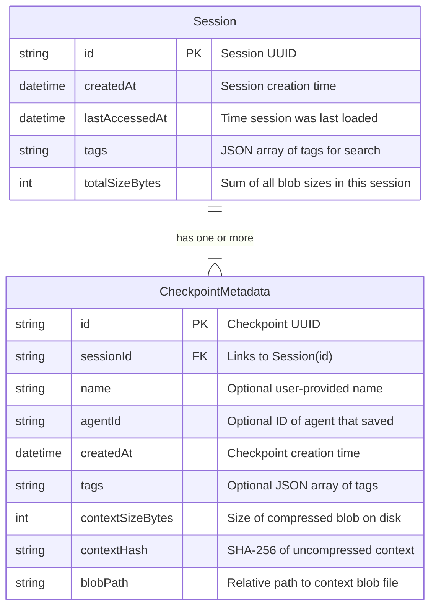

# Data Model (ERD) for Native Context Management

This document contains the Entity-Relationship Diagram for the session and checkpoint data models.

```mermaid
erDiagram
    Session {
        string id PK "Session UUID"
        datetime createdAt "Session creation time"
        datetime lastAccessedAt "Time session was last loaded"
        string tags "JSON array of tags for search"
        int totalSizeBytes "Sum of all blob sizes in this session"
    }

    CheckpointMetadata {
        string id PK "Checkpoint UUID"
        string sessionId FK "Links to Session(id)"
        string name "Optional user-provided name"
        string agentId "Optional ID of agent that saved"
        datetime createdAt "Checkpoint creation time"
        string tags "Optional JSON array of tags"
        int contextSizeBytes "Size of compressed blob on disk"
        string contextHash "SHA-256 of uncompressed context"
        string blobPath "Relative path to context blob file"
    }

    Session ||--|{ CheckpointMetadata : "has one or more"
``` 