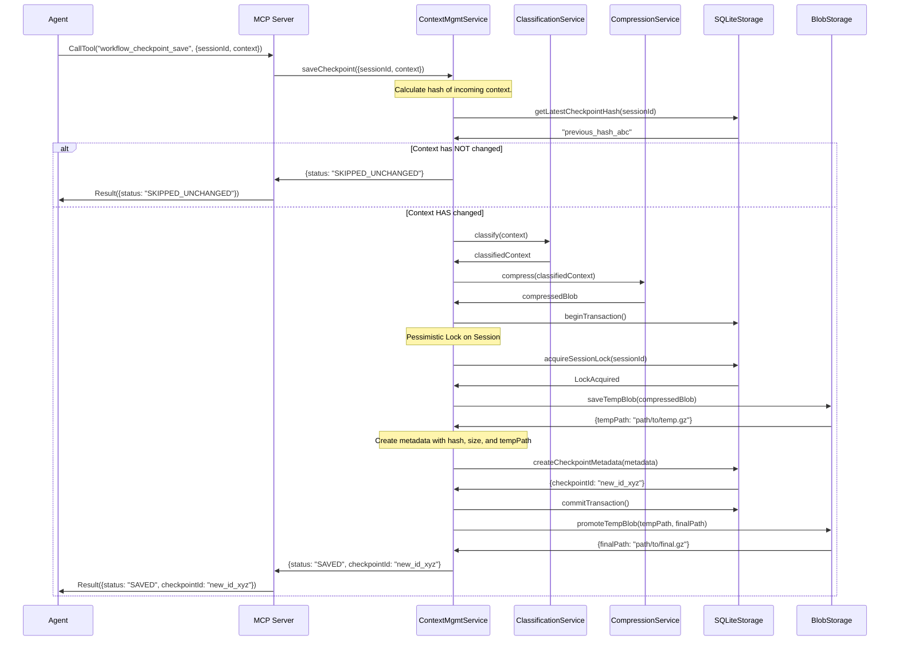

# Sequence Diagrams for Native Context Management

This document contains sequence diagrams illustrating the key operations of the context management feature.

## `workflow_checkpoint_save`

This diagram shows the end-to-end flow when an agent calls the `workflow_checkpoint_save` tool. It includes the logic for skipping unchanged context and the full path for saving a new checkpoint, including classification, compression, and atomic storage operations.

